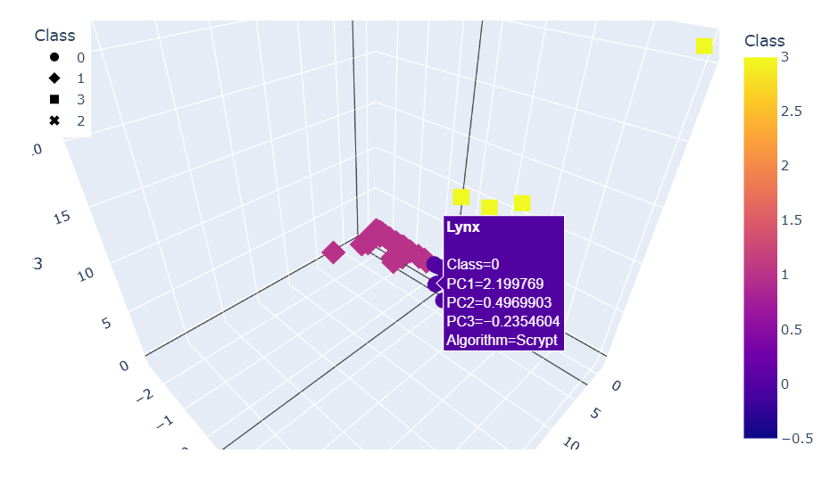

# Cryptocurrencies Analysis

## Overview
Accountability Accounting, a hypothetical investment bank, is interested in offering a cryptocurrency investment portfolio. The client requests a report that includes what cryptocurrencies are on the trading market, and how they can be grouped to create a classification system for the new investment.

### Resources
A crypto_data_csv file is provided for the analysis; Jupyter Notebook is used to analyze the data; the IPYMB file is located <a href='crypto_clustering.ipynb'>here</a>. Unsupervised Machine Learning Principal Component Analysis (PCA) algorithms were used to develop the report.

## Results
The following actions and information were developed as part of the client's requested report:
* The data was preprocessed for PCA
* Data Dimensions were reduced using PCA
* Cryptocurrency Clusters were developed using K-means
* Visualizations were developed

3-D Scatter Plot with Hover Data Information

